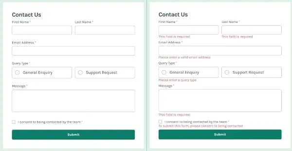

# Webová stránka se SASS a moderními nástroji

[Zobrazit formulář](https://mirjax2000.github.io/Contact-form/)

Tento projekt představuje webovou stránku vytvořenou pomocí **SASS** a moderních nástrojů pro správu
stylů, organizaci kódu a zlepšení vývojového procesu. Klíčové prvky zahrnují využití **PostCSS
autoprefixeru**, práci s **partial soubory**, **BEM metodologii** a další techniky zaměřené na
čistý, opakovaně použitelný a responzivní kód.

## Klíčové funkce a technologie

### 1. **SASS a organizace kódu**

- Struktura založená na **partial souborech**, což umožňuje snadnou správu a modularitu kódu.
- Použití **SASS placeholderů** (`%`), díky kterým se minimalizuje opakování kódu.
- **Media queries** integrovány přímo v SASS pro snadnou správu responzivity.
- Využití **SASS mixinů** pro opakovaně použitelné vzory a konzistenci stylů.

### 2. **PostCSS a autoprefixer**

- Integrovaný **PostCSS autoprefixer** zajišťuje kompatibilitu s různými prohlížeči bez nutnosti
  manuální správy prefixů.

### 3. **WebStorm a File Watcher**

- Nastavený **File Watcher** automatizuje kompilaci SASS do CSS, což šetří čas během vývoje.
- Optimalizovaná integrace nástrojů přímo ve vývojovém prostředí.

### 4. **BEM metodologie**

- Použití **BEM (Block, Element, Modifier)** pro snadno čitelné a škálovatelné pojmenování tříd.
- Kód je strukturován tak, aby byl snadno pochopitelný a udržovatelný.

### 5. **JavaScript a validace dat**

- Implementace **validace formulářových dat** v JavaScriptu.
- Příprava dat pro odesílání na backend.

### 6. **CSS logika a selektory**

- Použití selektoru `:has()` pro lehkou CSS logiku, což přináší nové možnosti při práci s
  dynamickými styly.

### 7. **Responzivita**

- Web je plně responzivní díky dobře definovaným **media queries** a flexibilnímu designu.

## Struktura projektu

